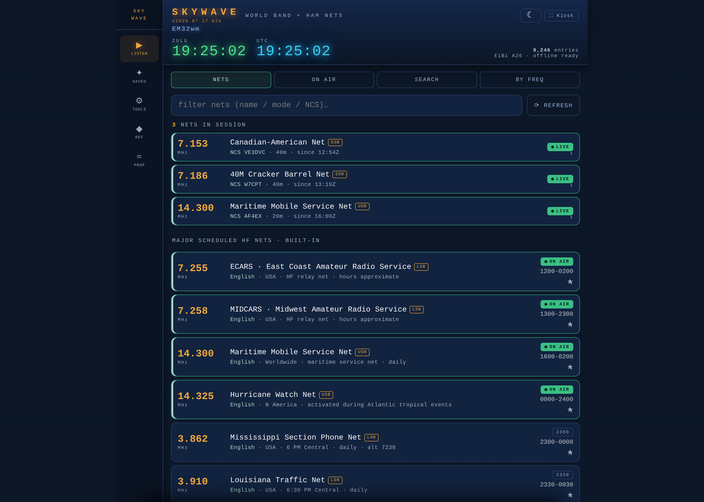
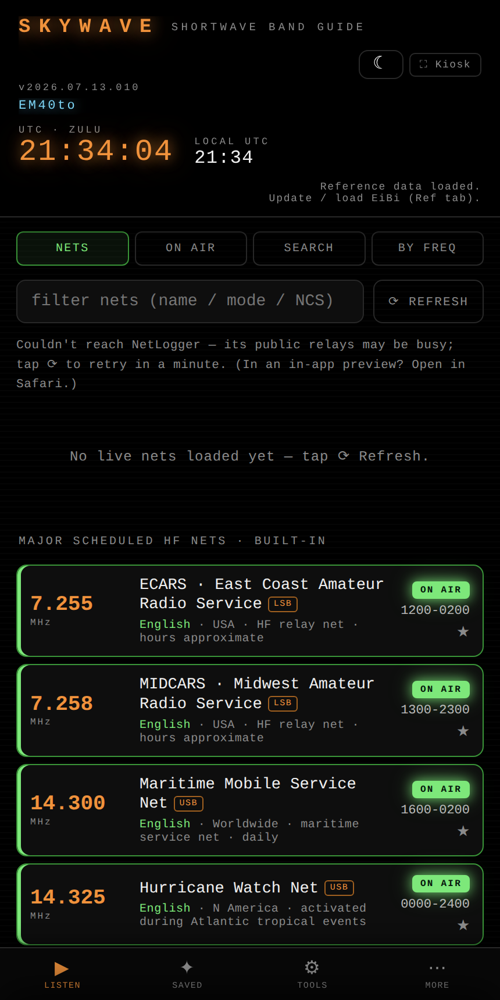
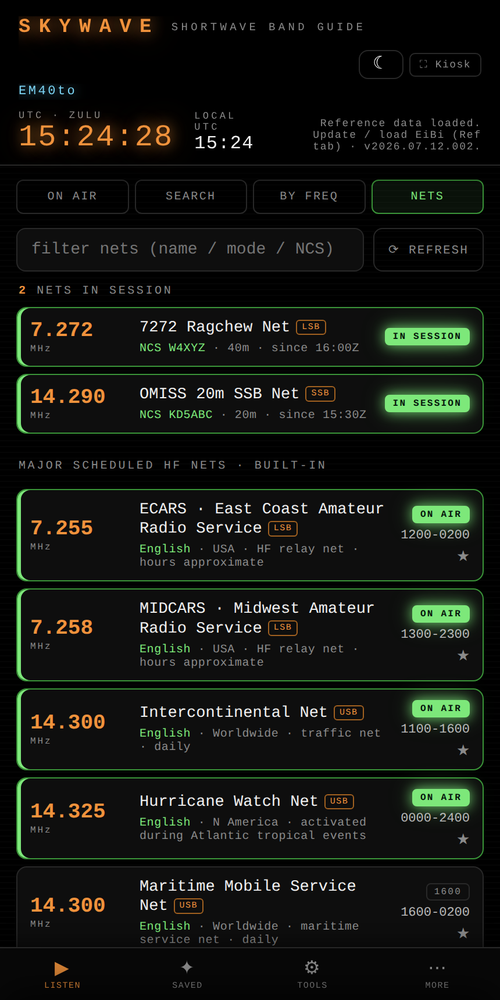

<div align="center">


# SKYWAVE

**A "TV Guide for shortwave." One HTML file that tells you what's on the air right now — broadcast stations, ham nets, and propagation — and keeps working with no signal bars and no build step.**

[](CHANGELOG.md)
[](#getting-started)
[](#architecture)
[](index.html)
[](LICENSE)

### → **[Live app: cdburgess75.github.io/SkyWave](https://cdburgess75.github.io/SkyWave/)** ←



<br><br>

&nbsp;&nbsp;

</div>

---

## Overview

Shortwave listening has a discovery problem: thousands of broadcasts rotate through the day on schedules buried in a 12,000-row CSV, and the usual answer is desktop software or a stack of printed guides. SKYWAVE turns that schedule into a live, filterable "what's on right now" view that runs on the device already in your pocket — including in the field, with no connectivity.

**Problems it solves**

- *"What can I hear at this hour?"* — the On Air view filters the full EiBi schedule down to broadcasts transmitting this minute, day-of-week aware, sorted by frequency.
- *"Who is that on 9.420?"* — type a dial frequency, get every scheduled match within ± tolerance, on-air entries first.
- *"Is anyone running a net?"* — live ham nets in session via NetLogger, plus the major scheduled HF nets built in.
- *"Which band should I try?"* — grayline timing and band-by-band advice computed on-device from your coordinates, plus live K-index.

**Why it stands out**

| | SKYWAVE | Typical alternatives |
|---|---|---|
| Install | Open a URL, add to home screen | Desktop app or paper guide |
| Offline | Everything except live feeds works in airplane mode | Usually online-only |
| Footprint | One ~90 KB HTML file, zero runtime dependencies | Multi-megabyte apps |
| Privacy | No account, no tracking, no server — data stays on-device | Varies |
| Build step | None. `index.html` is the app | Bundlers, frameworks |

## Key Features

| Feature | Detail |
|---------|--------|
| 📻 On Air Now | Live view of the EiBi schedule; chips for favorites/language, band + free-text filters, 30 s auto-refresh |
| 🔍 Search / By Freq | Full-text search across 12k+ entries; dial-frequency identification with ±2/5/10 kHz tolerance |
| 📡 Nets | Live nets in session (NetLogger API) + built-in directory of major HF nets (Maritime Mobile, Intercon, Hurricane Watch, ECARS, MIDCARS) — offline and on-air aware |
| ★ Favorites | Star any listing; ✓ "heard today" strikethrough that clears at 0000 UTC |
| 📝 My Frequencies | Your own nets/channels merged into every view |
| 🌅 Grayline planner | Sunrise/sunset/solar-noon + band advice from an on-device solar algorithm — no network |
| 📶 Propagation | HamQSL solar widget, live NOAA K-index with 8-period trend |
| 🛠 Field tools | Antenna calculator (dipole/vertical/loop), band-card export, print sheet, kiosk mode with wake-lock |
| 🎛 UX | LED dark/light themes, font scaling, Maidenhead grid in header, first-run location wizard, UTC + local clocks |
| 📴 PWA | Service worker + manifest; installs standalone, updates itself, EiBi schedule cached in localStorage |

## Architecture

```
SkyWave/
├── index.html              ← the entire application (HTML + CSS + JS, "use strict")
├── sw.js                   ← service worker: cache-first shell, background refresh
├── manifest.webmanifest    ← PWA install manifest
├── icons/                  ← SVG + PNG app icons
├── test/
│   └── smoke.mjs           ← Node + jsdom smoke harness (3 checks)
├── docs/
│   ├── ARCHITECTURE.md     ← data pipeline, rendering model, algorithms
│   ├── DATA_SOURCES.md     ← external API contracts (EiBi, NetLogger, NOAA, HamQSL)
│   └── screenshot-*.png
├── HANDOFF.md              ← full engineering handoff: conventions, storage schema, roadmap
└── CHANGELOG.md            ← CalVer (YYYY.MM.DD) history
```

Core data flow — one array, one renderer:

```
buildBase()  =  TIME stations + built-in nets + user frequencies      (always present)
EIBI[]       =  parsed EiBi CSV                                       (cached / fetched)
DATA         =  buildBase().concat(EIBI)     ← single source of truth
```

Design rules enforced throughout: no runtime dependencies, every `localStorage` access wrapped in `try/catch`, all dynamic rows use event delegation via `data-act` attributes, all network features cache their last result and render an explicit offline state. See [`docs/ARCHITECTURE.md`](docs/ARCHITECTURE.md).

## Getting Started

### Prerequisites

- **Users:** any modern browser. That's it — no account, no API keys.
- **Developers:** Node ≥ 18 (only for the test harness) and any static file server.

### Install as an app (recommended)

1. Open **[cdburgess75.github.io/SkyWave](https://cdburgess75.github.io/SkyWave/)** in Safari (iOS) or Chrome (Android/desktop) — not an in-app webview, which blocks `fetch`
2. **Share → Add to Home Screen** (iOS) or **Install app** (Chrome)
3. Launch from the home screen; on first run a 3-step wizard asks for your location (GPS or manual) to power grayline and grid-square features
4. Tap **⟳ Update now** on the Ref tab once while online to pull the full EiBi schedule — it's stored offline from then on

### Run locally

```bash
git clone https://github.com/cdburgess75/SkyWave.git
cd SkyWave
python3 -m http.server 8000    # any static server works
# open http://localhost:8000
```

Opening `index.html` directly from disk also works for everything except the service worker.

## Usage

| I want to… | Do this |
|------------|---------|
| See what's broadcasting now | **Listen → On Air** — filter by band, language, or text |
| Identify a signal on the dial | **Listen → By Freq** — type `9420` or `9.420` |
| Find active ham nets | **Listen → Nets** — live list on top, scheduled majors below |
| Keep a station | Tap **★** on any row; find it under **Saved** |
| Mark a catch | Tap **✓** on a favorite — struck through until 0000 UTC |
| Plan a band opening | **Tools → Grayline** — band advice for your location |
| Cut an antenna | **Tools → Antenna calculator** — enter MHz or kHz |
| Update the schedule | **Ref → ⟳ Update now** (auto-updates on launch when stale) |

### Run the test suite

```bash
npm install -D jsdom   # one-time
node test/smoke.mjs
```

Three checks must pass: script syntax, `getElementById` ↔ HTML id coverage, and a full jsdom boot.

## Contributing

Small, focused PRs are welcome. Ground rules (full detail in [`HANDOFF.md`](HANDOFF.md)):

- **Keep it one file.** No frameworks, no build step, no runtime dependencies.
- **Offline-first is the contract.** A network feature must cache its last result and render a sensible offline/failed state.
- **Escape everything** rendered from data (`esc()` for text, `attr()` for attributes).
- **Run `node test/smoke.mjs`** before pushing — all three checks green.
- Version bumps are CalVer (`YYYY.MM.DD`) in `index.html` **and** `sw.js` cache name, with a [`CHANGELOG.md`](CHANGELOG.md) entry.

Operating-side features (QSO logging, POTA/SOTA spots, ADIF) belong in the companion app **[PileUp](https://github.com/cdburgess75/PileUp)**, not here.

## Data Sources & Credits

| Source | Used for | Terms |
|--------|----------|-------|
| [EiBi](http://www.eibispace.de) © Eike Bierwirth | Broadcast schedule | Free to copy & distribute, attribute EiBi |
| [NetLogger](https://www.netlogger.org) | Live nets in session | Fetched only on demand |
| [NOAA SWPC](https://www.swpc.noaa.gov) | Planetary K-index | Public API |
| [HamQSL](https://www.hamqsl.com) N0NBH/K4HG | Solar conditions | Linked & credited |

## License

Code is [MIT](LICENSE). Schedule data remains © EiBi under its own terms — do not relicense the data.

<div align="center"><sub>Built for offline field use · All times UTC · 73</sub></div>
