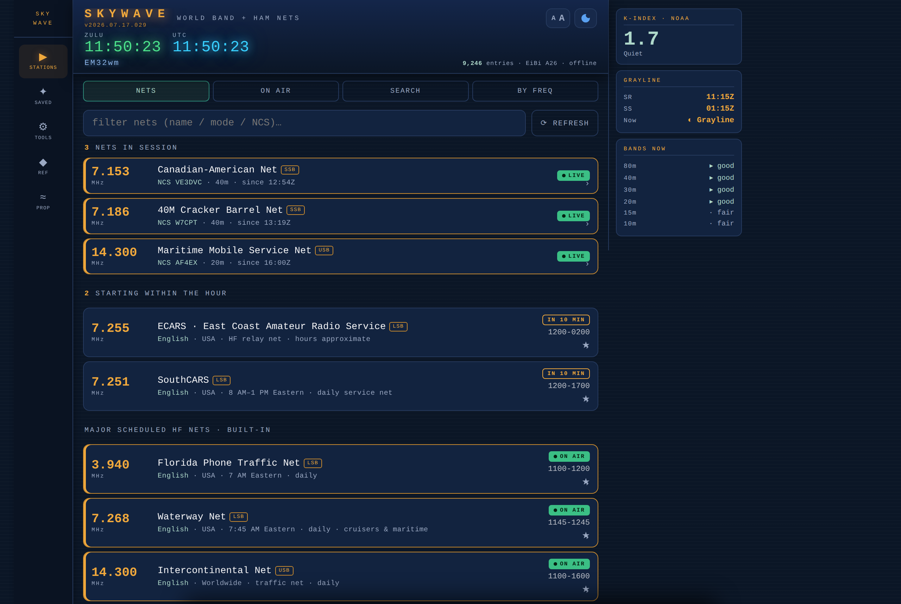
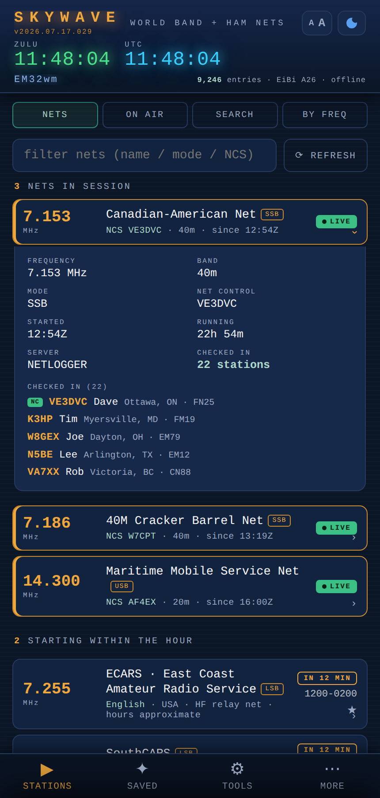
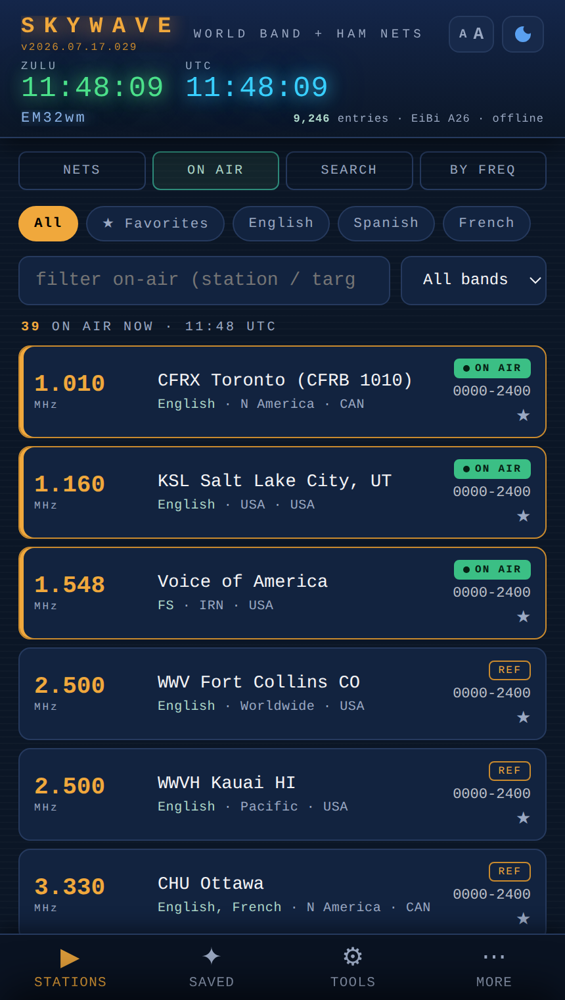
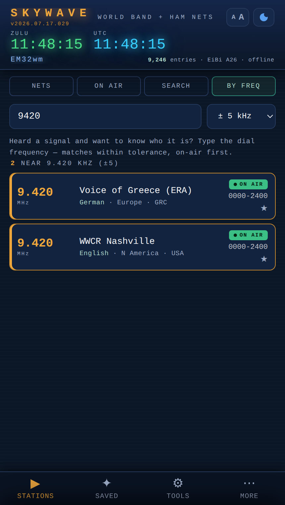
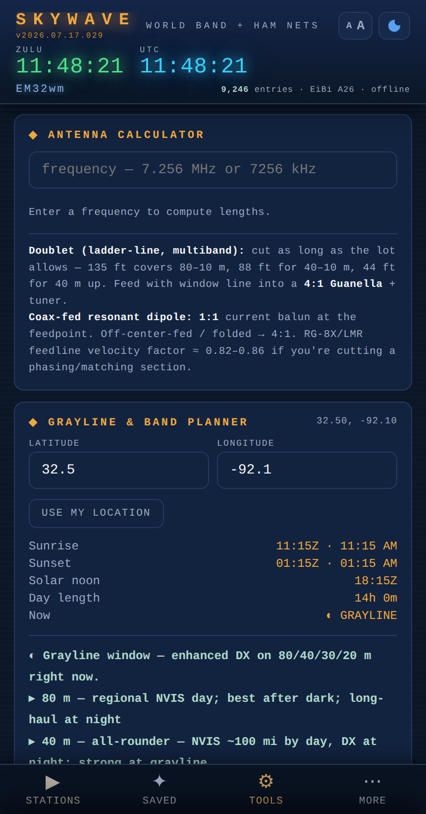
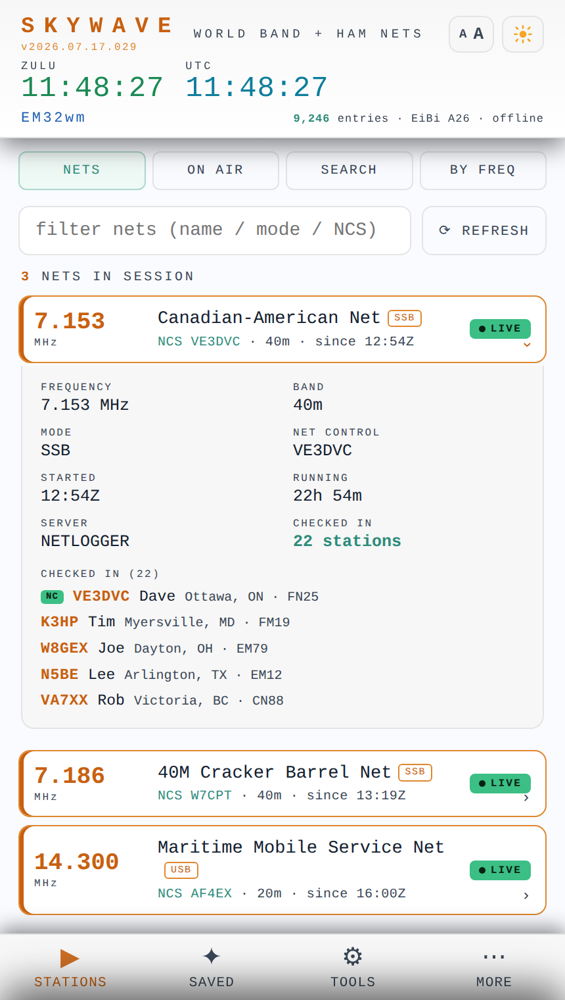

<div align="center">


# SkyWave

**A "TV Guide" for the radio bands — what's on the air right now across longwave, mediumwave & shortwave, plus live amateur-radio HF nets with who's checked in. One HTML file, works offline.**

[](https://cdburgess75.github.io/SkyWave/)
[](CHANGELOG.md)
[](#install-it-as-an-app)
[](#how-it-works)
[](index.html)
[](LICENSE)

### → **[Open the live app](https://cdburgess75.github.io/SkyWave/)** ←



</div>

---

## Overview

Radio listening has a discovery problem. Thousands of broadcasts move through the bands over the course of a day on schedules buried in a 9,000-row CSV, and the amateur-radio nets that come and go are scattered across a live logging site. The usual answer is desktop software or a stack of printed guides.

SkyWave turns all of that into a single "what's on right now" view that runs on the device already in your pocket — including in the field, with no signal. It covers the **entire broadcast spectrum** (longwave, mediumwave, and shortwave — about 16 kHz to 26 MHz), shows the **amateur-radio HF nets in session** with their live check-in rosters, and computes **grayline and band conditions** on-device from your coordinates.

It's one static HTML file. No account, no tracking, no server, no build step.

## Features

- **Live HF ham nets** — amateur-radio nets in session right now, refreshed automatically. Tap any net to expand a live **check-in roster** — callsign, name, city/state, grid square, with the net control station marked **NC**. Plus a built-in directory of major national and Southeast-US HF nets (traffic nets, SouthCARS, Maritime Mobile, Hurricane Watch, and more) that stays available offline.
- **On Air now** — every shortwave, mediumwave, and longwave broadcast transmitting *this minute*, filtered from the full EiBi schedule (9,000+ entries), day-of-week aware and sorted by frequency. Filter by favorites, language, band, or free text.
- **Identify a signal** — heard something on the dial? Type the frequency (e.g. `9420`) and get every scheduled station near it within a ± tolerance you choose, on-air entries first.
- **Grayline & band planner** — sunrise, sunset, solar noon, day length, and plain-language band-by-band advice, all computed on your device from your location. No network needed.
- **Propagation** — live NOAA planetary K-index with an 8-period trend, plus quick links to solar data, VOACAP/Proppy, WebSDR receivers, and DX clusters.
- **Field tools** — antenna calculator (dipole / vertical / loop, feet & meters), band-card export, a printable reference sheet, and a kiosk / shack-monitor mode that keeps the screen awake.
- **Yours to keep** — star any station or net into Favorites, mark catches as "heard today," and add your own frequencies so they appear alongside everything else.
- **Installs like an app** — add it to your home screen and it runs full-screen and offline; the schedule is cached locally and the app updates itself.
- **Light & dark, any text size** — a neon "shack" dark theme and a clean light theme, with a built-in text-size control.

## Screens

| Live nets + check-in roster | On Air (LW / MW / SW) | Identify by frequency |
|---|---|---|
|  |  |  |

| Field tools (antenna + grayline) | Light theme |
|---|---|
|  |  |

## Getting started

### Just use it

Open **[cdburgess75.github.io/SkyWave](https://cdburgess75.github.io/SkyWave/)** in any modern browser. No account, no setup.

### Install it as an app

1. Open the live link in **Safari** (iOS) or **Chrome** (Android/desktop) — not an in-app webview, which blocks live data.
2. **Share → Add to Home Screen** (iOS) or **⋮ → Install app** (Chrome).
3. On first launch a short wizard asks for your location (GPS or manual) to power the grayline and grid-square features. You can skip it and set it later from the **Ref** tab.
4. While online, tap **Ref → ⟳ Update now** once to pull the full EiBi schedule — it's stored offline from then on and refreshes itself when it gets stale.

New here? The **[full User Guide](docs/GUIDE.md)** walks through every tab in plain English.

### Run it locally

```bash
git clone https://github.com/cdburgess75/SkyWave.git
cd SkyWave
python3 -m http.server 8000   # any static file server works
# open http://localhost:8000
```

Opening `index.html` straight from disk works for everything except the service worker.

## How it works

SkyWave is a single `index.html` — HTML, CSS, and vanilla JavaScript (`"use strict"`), with a service worker for offline support. There is **no framework and no build step**; the file you open is the app.

```
SkyWave/
├── index.html              ← the entire application (HTML + CSS + JS)
├── sw.js                   ← service worker: cache-first shell, self-update
├── manifest.webmanifest    ← PWA install manifest
├── icons/                  ← SVG + PNG app icons
├── scripts/
│   └── fetch-nets.mjs      ← builds the live-nets + roster mirror (see below)
├── .github/workflows/      ← CI (tests) + the nets-mirror and Pages deploys
├── test/                   ← Node smoke test + nets-parser unit tests
└── docs/                   ← user guide, architecture notes, data sources, images
```

**Data flow.** One array is the single source of truth: built-in time stations and net directory + your own frequencies + the parsed EiBi schedule. Every view is a filter over that array, rendered through event delegation.

**Staying dependency-free.** The app never calls a third-party API directly. Live ham-net data (including the check-in rosters) is fetched **server-side by a scheduled GitHub Action** in this repo, which mirrors it to a data branch the app reads over CORS-open `raw.githubusercontent.com`. Everything else — grayline, band advice, antenna math — is computed on-device.

Design rules held throughout: no runtime dependencies, every `localStorage` access wrapped in `try/catch`, all rendered data escaped, and every network feature caches its last result and renders an explicit offline state. See [`docs/ARCHITECTURE.md`](docs/ARCHITECTURE.md) and [`docs/DATA_SOURCES.md`](docs/DATA_SOURCES.md).

### Tests

```bash
npm install -D jsdom   # one-time
node test/smoke.mjs    # script syntax, id coverage, full jsdom boot
node test/nets-parser.mjs
```

## Tech stack

- **Vanilla JavaScript** (ES modules for tooling), HTML, CSS — no runtime dependencies
- **PWA**: service worker (cache-first) + web app manifest
- **GitHub Actions** for CI and as a server-side data mirror (keeps the app third-party-free)
- **GitHub Pages** for hosting
- **Node + jsdom** for the test harness

## Data sources & credits

| Source | Used for | Terms |
|--------|----------|-------|
| [EiBi](http://www.eibispace.de) © Eike Bierwirth | Longwave / mediumwave / shortwave broadcast schedule | Free to copy & distribute, attribute EiBi |
| [NetLogger](https://www.netlogger.org) | Live ham nets in session + check-in rosters | Mirrored server-side by this repo's GitHub Action |
| [NOAA SWPC](https://www.swpc.noaa.gov) | Planetary K-index | Public API |
| [HamQSL](https://www.hamqsl.com) N0NBH/K4HG | Solar conditions | Linked & credited |

## Contributing

Small, focused PRs are welcome. Ground rules (full detail in [`HANDOFF.md`](HANDOFF.md)):

- **Keep it one file.** No frameworks, no build step, no runtime dependencies.
- **Offline-first is the contract.** A network feature must cache its last result and render a sensible offline state.
- **Escape everything** rendered from data.
- **Run the tests** before pushing (`node test/smoke.mjs`).
- Version bumps are CalVer (`YYYY.MM.DD`) in `index.html` **and** the `sw.js` cache name, with a [`CHANGELOG.md`](CHANGELOG.md) entry.

SkyWave is a listening guide, not a logger — operating-side features (QSO logging, POTA/SOTA spotting, ADIF) are out of scope.

## License

Code is [MIT](LICENSE). Schedule data remains © EiBi under its own terms — please don't relicense the data.

<div align="center"><sub>Built for offline field use · all times UTC · 73</sub></div>
