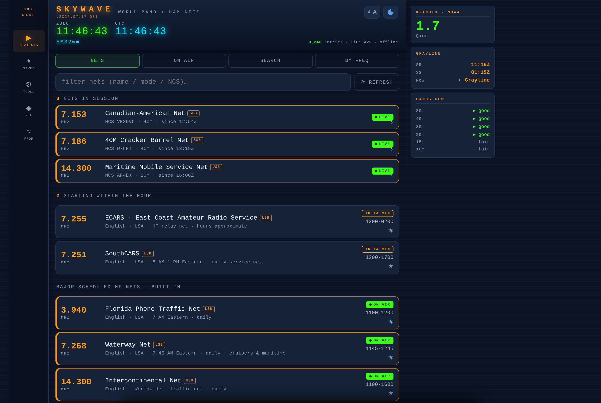
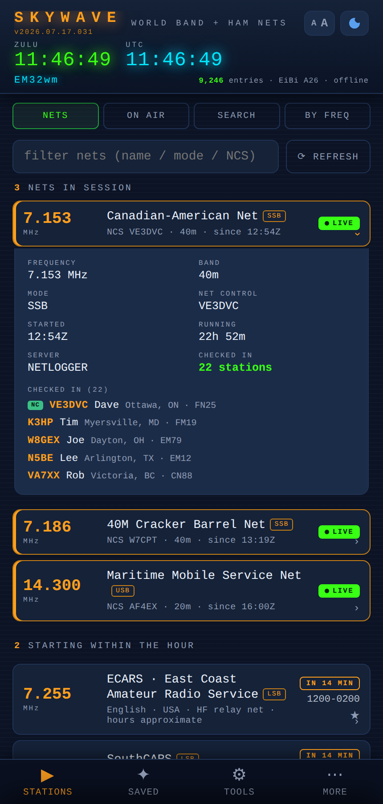
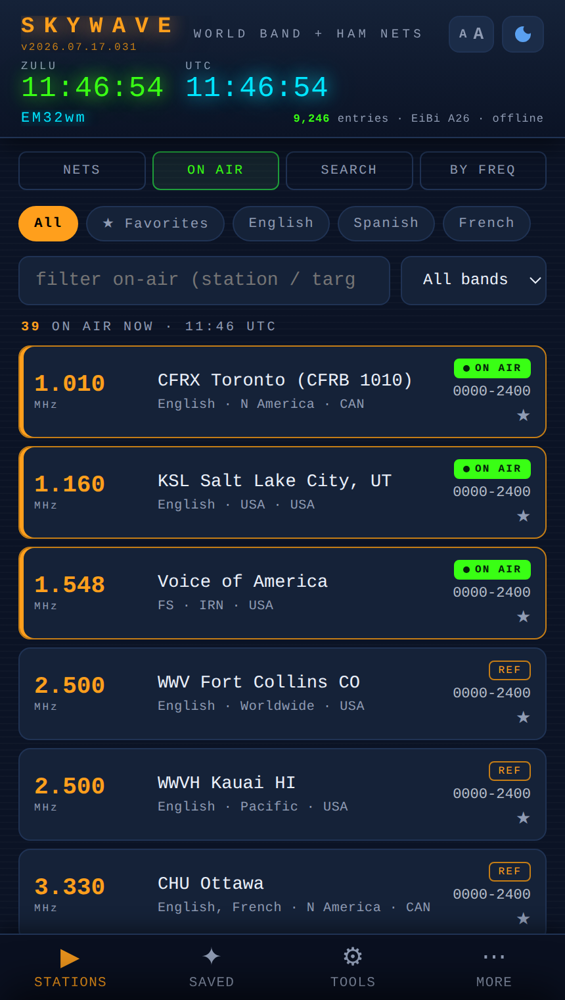
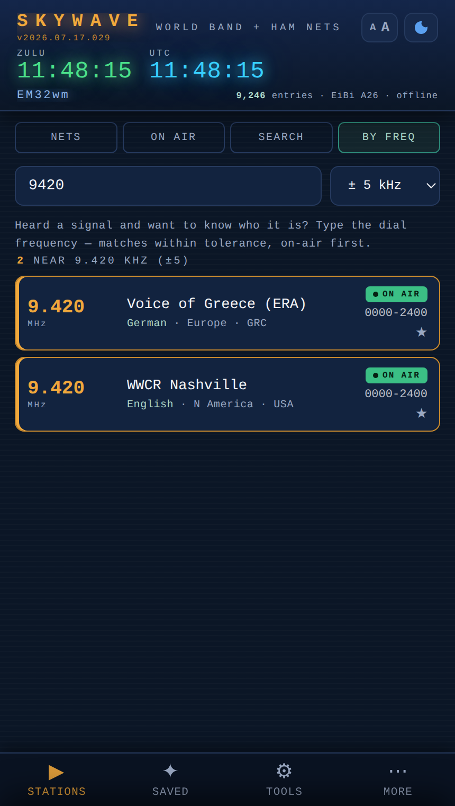
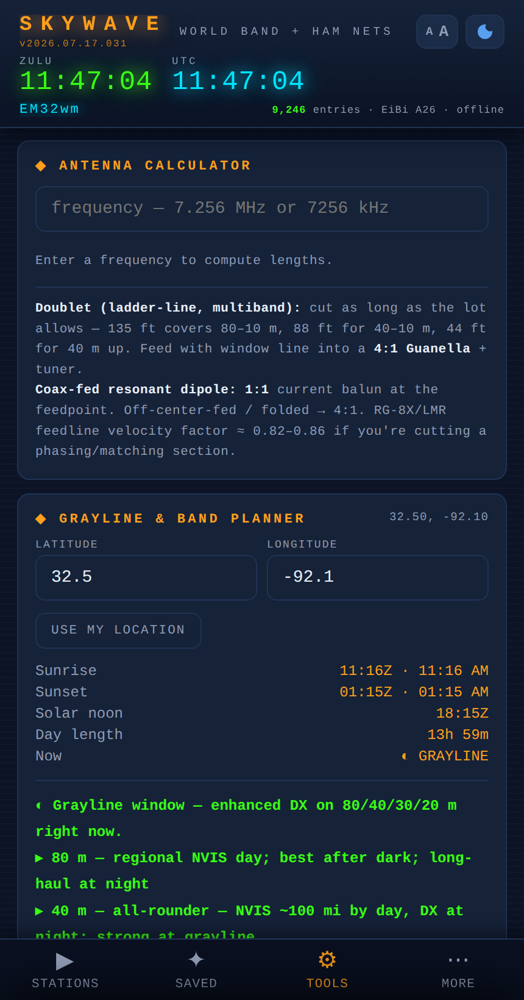
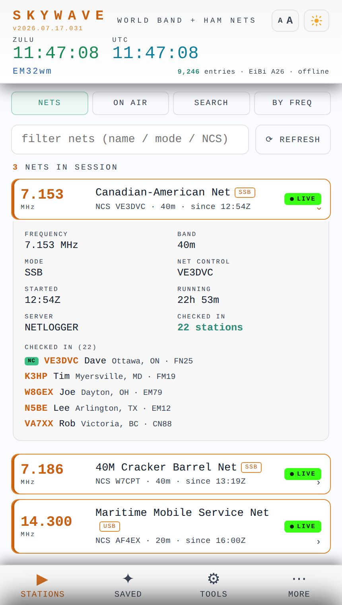

<div align="center">


# SKYWAVE

### A TV Guide for the radio bands.

**See what's on the air right now** across longwave, mediumwave and shortwave — plus the amateur-radio HF nets in session and who's checked into them. One HTML file. Works with no signal.

<br>

<!-- ═══════════════ PRIMARY CALL TO ACTION ═══════════════ -->

<a href="https://cdburgess75.github.io/SkyWave/">

</a>

**[cdburgess75.github.io/SkyWave](https://cdburgess75.github.io/SkyWave/)** — no signup, no download, nothing to configure
<br>📱 On a phone? [Save it to your home screen ↓](#-save-it-to-your-phone)

<br>

<!-- ═══════════════ HERO VISUAL ═══════════════
     CURRENT: real desktop screenshot (docs/images/desktop.png).
     UPGRADE PATH: record an animated GIF as docs/images/hero.gif and swap the
     src below. Ideal capture: an 8–12 s loop at ~1400×880 showing
       (1) the On Air list with the clocks ticking,
       (2) tapping a live net to expand its check-in roster,
       (3) the green "Grayline now" banner appearing.
     Keep it under 8 MB so GitHub inlines it without a click.
-->


<br><br>

[](https://cdburgess75.github.io/SkyWave/)
[](CHANGELOG.md)
[](#-save-it-to-your-phone)
[](#-how-it-works)
[](index.html)
[](LICENSE)

</div>

---

## Why SkyWave

Radio listening has a discovery problem. Thousands of broadcasts move through the bands every day on schedules buried in a 9,000-row CSV, and the amateur nets that come and go live on a separate logging site. The usual answer is desktop software, printed guides, or both.

SkyWave turns all of it into a single **"what's on right now"** view that runs on the device already in your pocket — including in the field, with no signal.

- **9,361 broadcast entries** spanning **16.3 kHz – 26.2 MHz**: longwave, mediumwave and shortwave, not just the SW bands most guides stop at
- **Live HF ham nets** with full check-in rosters, refreshed automatically
- **Grayline, band advice and propagation**, computed on-device from your coordinates

No account. No tracking. No server. No build step. The file you open *is* the app.

---

## ✦ Features

**📻 Know what you're hearing**
- **On Air now** — every broadcast transmitting *this minute*, day-of-week aware, sorted by frequency. Filter by favorites, language, band or free text.
- **Identify a signal** — heard something on the dial? Type `9420` and get every scheduled station within a ± tolerance you choose, on-air entries first.

**📡 Work the nets**
- **Live nets in session** — refreshed automatically, with a tap-to-expand **check-in roster**: callsign, name, city/state, grid square, net control marked **NC**.
- **Built-in net directory** — major national and Southeast-US HF nets (traffic nets, SouthCARS, Maritime Mobile, Hurricane Watch and more), available offline, on-air aware, star-able.

**🌗 Catch the opening**
- **Grayline alerts** — a header banner warns you **30 min** and **5 min** before the grayline window opens, then counts it down live. One tap exports **calendar reminders** (.ics) so your phone alerts you even with SkyWave closed.
- **Band planner** — sunrise, sunset, solar noon, day length and plain-language band-by-band advice, computed on your device. No network needed.
- **Propagation** — live NOAA planetary K-index with an 8-period trend, plus quick links to solar data, VOACAP/Proppy, WebSDR receivers and DX clusters.

**🎒 Built for the field**
- **Genuinely offline** — the full schedule is stored on-device; grayline, band advice and antenna math never touch the network.
- **Field tools** — antenna calculator (dipole / vertical / loop, feet & meters), band-card export, a printable reference sheet, and a kiosk / shack-monitor mode that keeps the screen awake.
- **Yours to keep** — star stations and nets, mark catches as "heard today," add your own frequencies alongside everything else.
- **Light & dark, any text size** — a neon "shack" dark theme, a clean light theme, and a built-in text-size control.

---

## 📸 Screenshots

| Live nets + check-in roster | On Air (LW / MW / SW) | Identify by frequency |
|:---:|:---:|:---:|
|  |  |  |

| Field tools (antenna + grayline) | Light theme |
|:---:|:---:|
|  |  |

<!-- ═══════════════ SCREENSHOTS TO ADD ═══════════════
     Two captures would complete this gallery. Save them as:

       docs/images/grayline-alert.png — phone-width (~780 px wide) shot of the
         green "◐ GRAYLINE NOW" banner in the header with the countdown showing.

       docs/images/install-ios.png — iOS Safari share sheet with "Add to Home
         Screen" visible/circled (used again in the install section below).

     Then append this row to the second table above:

| Grayline alert | Add to Home Screen |
|:---:|:---:|
|  |  |
-->

---

## 📱 Save it to your phone

SkyWave is a **Progressive Web App**: saved to your home screen it launches full-screen from its own icon, with no browser chrome — and **keeps working with no signal**.

> **Do this once, while online:** open the app and tap **Ref → ⟳ Update now**. That stores the full schedule on your device. From then on, airplane mode is fine.

###  &nbsp;iPhone & iPad

1. Open **[cdburgess75.github.io/SkyWave](https://cdburgess75.github.io/SkyWave/)** in **Safari** — it must be Safari; Chrome and in-app browsers on iOS can't install web apps
2. Tap the **Share** button (the square with the arrow, bottom of the screen)
3. Scroll down and tap **Add to Home Screen**
4. Tap **Add** — SkyWave appears on your home screen like any app

<!-- IMAGE PLACEHOLDER: docs/images/install-ios.png
     A screenshot of the Safari share sheet with "Add to Home Screen" circled.
     ~600 px wide is plenty. Insert here as:
     
-->

###  &nbsp;Android

1. Open **[cdburgess75.github.io/SkyWave](https://cdburgess75.github.io/SkyWave/)** in **Chrome**
2. Tap the **⋮** menu (top-right)
3. Tap **Install app** — older versions say **Add to Home screen**
4. Confirm with **Install**

Chrome often offers an **Install** banner on its own after a few seconds — that works too.

<!-- IMAGE PLACEHOLDER: docs/images/install-android.png
     The Chrome ⋮ menu open with "Install app" highlighted. Insert here as:
     
-->

### 🖥️ Desktop

In Chrome or Edge, click the **install icon** in the address bar (a screen with a down-arrow), or **⋮ → Cast, save and share → Install page as app**.

### What you get once installed

|  |  |
|---|---|
| 🚀 | Launches full-screen from its own icon — no address bar, no tabs |
| ✈️ | Works in airplane mode once the schedule is stored |
| 🔄 | Updates itself in the background and shows a banner when a new version is ready |
| 💾 | Favorites, location and settings persist on-device |

On first launch, a 60-second wizard asks for your location (GPS or manual) to power the grayline and grid-square features — you can skip it and set it later from the **Ref** tab. New here? The **[full User Guide](docs/GUIDE.md)** walks through every tab in plain English.

---

## 🚀 Quick start (run it locally)

The app is one static file — all you need is something that serves it.

**Prerequisites**

| Requirement | Why | Notes |
|---|---|---|
| Any static file server | Service workers won't run from `file://` | Python, Node, anything |
| Node.js 20+ | *Only* for the test suite | Not needed to run the app |

There is **no install step and no build step** — nothing to `npm install` to run the app.

**Clone**

```bash
git clone https://github.com/cdburgess75/SkyWave.git
cd SkyWave
```

**Run**

```bash
python3 -m http.server 8000
# → open http://localhost:8000
```

<details>
<summary>Prefer Node?</summary>

```bash
npx serve .            # or: npx http-server -p 8000
```

</details>

> Opening `index.html` straight from disk works for everything except the service worker (so: no offline caching, no install prompt).

**Test**

```bash
npm install -D jsdom   # one-time — the only dev dependency
npm test               # all three suites

node test/smoke.mjs        # script syntax, id coverage, full jsdom boot
node test/domain.mjs       # on-air windows, day/season rules, sun times, grayline alerts, .ics export
node test/nets-parser.mjs  # live-net feed shapes
```

---

## 🔧 How it works

SkyWave is a single `index.html` — HTML, CSS and vanilla JavaScript (`"use strict"`), with a service worker for offline support. There is **no framework and no build step**; the file you open is the app.

```
SkyWave/
├── index.html              ← the entire application (HTML + CSS + JS)
├── sw.js                   ← service worker: cache-first shell, self-update
├── manifest.webmanifest    ← PWA install manifest
├── icons/                  ← SVG + PNG app icons
├── scripts/
│   ├── fetch-eibi.mjs      ← builds the broadcast-schedule mirror
│   └── fetch-nets.mjs      ← builds the live-nets + roster mirror
├── .github/workflows/      ← CI (tests), both data mirrors, Pages deploy
├── test/                   ← Node test suites (smoke, domain, nets-parser)
└── docs/                   ← user guide, architecture notes, data sources, images
```

**Data flow.** One array is the single source of truth: built-in time stations and net directory + your own frequencies + the parsed EiBi schedule. Every view is a filter over that array, rendered through event delegation. The schedule lives in IndexedDB; small state stays in guarded localStorage.

**Staying dependency-free.** The app never calls a third party — not for the schedule, not for the nets, not through anyone's CORS proxy. Both live feeds are fetched **server-side by scheduled GitHub Actions in this repo** and mirrored to a data branch the app reads over CORS-open `raw.githubusercontent.com`: the EiBi schedule daily, live ham nets (with check-in rosters) on a rolling schedule. Everything else — grayline, band advice, antenna math — is computed on-device.

Design rules held throughout: no runtime dependencies, every storage access wrapped in `try/catch`, all rendered data escaped, and every network feature caches its last result and renders an explicit offline state.

📖 Deeper detail: [`docs/ARCHITECTURE.md`](docs/ARCHITECTURE.md) · [`docs/DATA_SOURCES.md`](docs/DATA_SOURCES.md) · [`HANDOFF.md`](HANDOFF.md)

---

## 🛠️ Tech stack

<div align="center">


<br>


</div>

| Layer | Choice | Why |
|---|---|---|
| UI | Vanilla JS + HTML + CSS | No framework, no bundler — one readable, portable file |
| Offline | Service worker + manifest | Cache-first shell; schedule in IndexedDB |
| Live data | GitHub Actions as a server-side mirror | Zero third-party calls from the app |
| Hosting | GitHub Pages | Static, free, nothing to maintain |
| Tests | Node + jsdom | Three suites, one dev dependency |

*(No React, no Tailwind, no Node at runtime — the absence of a stack is the point: the app stays a single auditable file that works offline forever.)*

---

## 📚 Data sources & credits

| Source | Used for | Terms |
|--------|----------|-------|
| [EiBi](http://www.eibispace.de) © Eike Bierwirth | LW / MW / SW broadcast schedule | Free to copy & distribute with attribution — mirrored server-side by this repo |
| [NetLogger](https://www.netlogger.org) | Live ham nets + check-in rosters | Mirrored server-side by this repo's Action |
| [NOAA SWPC](https://www.swpc.noaa.gov) | Planetary K-index | Public API |
| [HamQSL](https://www.hamqsl.com) N0NBH/K4HG | Solar conditions | Linked & credited |

No third-party CORS proxy sits between you and any source. The roster mirror deliberately drops the street address, ZIP, county and member ID the upstream API also returns — only ham-public fields (callsign, first name, city/state, grid) are published.

---

## 🤝 Contributing

Small, focused PRs are welcome. Ground rules (full detail in [`HANDOFF.md`](HANDOFF.md)):

- **Keep it one file.** No frameworks, no build step, no runtime dependencies.
- **Offline-first is the contract.** A network feature must cache its last result and render a sensible offline state.
- **Escape everything** rendered from data.
- **Run the tests** before pushing — `npm test`.
- Version bumps are CalVer (`YYYY.MM.DD.NNN`) in `index.html` **and** the `sw.js` cache name, with a [`CHANGELOG.md`](CHANGELOG.md) entry.

SkyWave is a listening guide, not a logger — operating-side features (QSO logging, POTA/SOTA spotting, ADIF) are out of scope.

---

## 📄 License

Code is [MIT](LICENSE). Schedule data remains © EiBi under its own terms — please don't relicense the data.

<div align="center">
<br>

### **[▶ Open SkyWave now](https://cdburgess75.github.io/SkyWave/)**

<sub>Built for offline field use · all times UTC · 73</sub>

</div>
